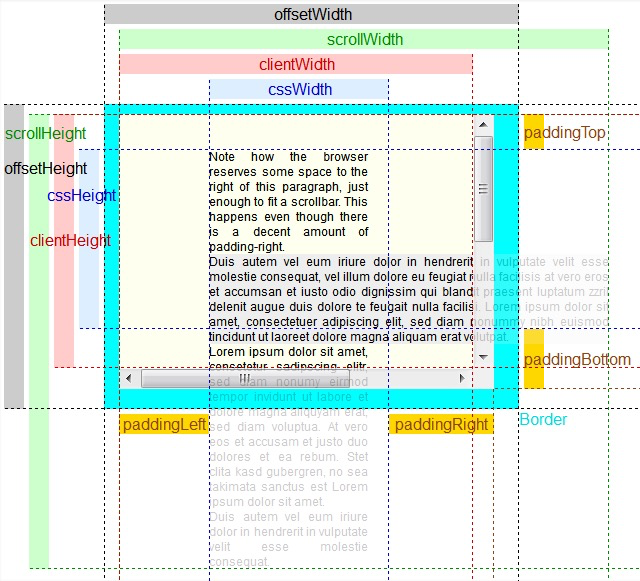

# 盒模型相关

## 百分比数值

- 以百分比作为 单位时，会以父元素的宽度作为基数

## 标注与怪异盒模型 box-sizing 属性

- 标准盒模型
  - `box-sizing: content-box`
  - box width/height = content-width/height
- 怪异盒模型
  - `box-sizing: border-box`
  - box width/height = content-width/height + padding + border

## Height 和 Width 的计算方式

- client

  - client=css-width+padding

- 内容可视区域 offset

  - offset=client+scrollbar+border
  - 可视区域加上 滚动条/边框等

- scrollWidth
  - 内容的真实宽度

## 边距塌陷

- 当使用负边距时，塌陷后的边距等于最大的正边距和最大负边距的代数和。

- 相邻元素
  - 相邻元素的 margin 值，将取二者之间较大的数值作为实际的 margin 值
- 父子元素
  - 块级父元素 无 padding/border/行内元素与清除浮动 则其上下边距将以 父与子元素的 margin-top/bottom 二者较大的值做实际的 margin
- 空的块级元素
  - 当一个空的块级元素的上边距（margin-top）和下边距（margin-bottom）之间没有 border，padding，行内元素，height，min-height 分隔时，上下边距会塌陷。
