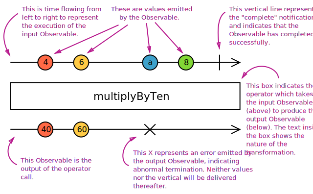

# Rxjs

- **事件相关**的工具类库
- 通过**可观察序列**将**异步**和**事件**组合处理的程序
- 通过 **观察者** **迭代器** **函数式编程** **集合** 结合起来,以实现对事件的有序管理
- [Rxjs 文档](https://rxjs.dev/guide/overview)
- [Rxjs repo](https://github.com/ReactiveX/rxjs)

## 个人理解

- 如何理解 Pull 机制

  - 消费者 调用 生产者得到 需要的数据.

    ```javascript
    /** Function  */
    function producer() {
      // 生产数据, 只有 producer() 被调用 才继续执行
      return '1'
    }

    function consumer() {
      const data = producer() // * 决定获取数据
    }

    /** Iterator */
    function* generator() {
      // 生产数据, 只有 gen.next 被调用 才继续执行
      yield 1
      yield 2
      yield 3
    }
    function consumer() {
      const gen = generator()
      gen.next() // * 决定获取数据
    }
    ```

- 如何理解 Push 机制

  - 消费者 通过对 生产者的观察, 当生产者产生新数据时, 通过对应的观察关系. 推送数据给消费者

    ```javascript
    new Promise((resolve) => {
      /** Producer */
      /** Some code */
      resolve()
    }).then(() => {
      /** Consumer */
    })

    import { Observable } from 'rxjs'
    const foo = new Observable((subscriber) => {
      /** Producer */
      subscriber.next(1)
      subscriber.next(2)
      subscriber.complete()
    })

    foo.subscribe(
      /** Observer */
      { next: (val) => console.info(val) },
    )
    ```

## Observable

- 可被调用的集合. 在 Rx 里作为 Producer

|      | System  | Single   | Multi      | Producer                              | Consumer                              |
| ---- | ------- | -------- | ---------- | ------------------------------------- | ------------------------------------- |
| Pull | Default | Function | Iterator   | Passive: produces data when requested | Active: Decides when data is required |
| Push | Rxjs    | Promise  | Observable | Active: produces data at its own pace | Passive: reacts to received data      |

- Observable 和 Function 相似
  - Observable 通过 subscribe 订阅执行
  - Function 通过直接调用 或 .call 执行
- Observable 和 Function 区别

  - Function 只支持同参数返回同样的值(纯函数情况下)

    ```javascript
    function foo() {
      console.log('Hello')
      return 42
      return 100 // dead code. will never happen
    }

    foo.call()
    // Hello
    // 42
    ```

  - Observable 支持 返回多个值

    ```javascript
    import { Observable } from 'rxjs'
    const foo = new Observable((subscriber) => {
      console.log('Hello')
      subscriber.next(42)
      subscriber.next(100) // "return" another value
      subscriber.next(200) // "return" yet another
    })

    foo.subscribe((x) => {
      console.log(x) // Push system.
    })

    // Hello
    // 42
    // 100
    // 200
    ```

- foo.call: give me one value synchronously
- observable.subscribe: give me any amount of value, either synchronously or asynchronously

## Observer

- 监听 并消费 Observable 传递地值
- 是一系列回调的组合

```javascript
const observer = {
  next: (v) => console.info(`Observer got a next value: ${v}`),
  error: (err) => console.error(`Observer got an error: ${v}`),
  complete: () => console.ifo(`Observer got a complete notification`),
}

observable.subscribe(observer)
```

## Subscription

- 包含 一个 `unsubscribe` 去释放资源 或 取消 observable 的执行的
- 由 `observable.subscribe(...)` 返回
- 支持 add 方法, 可同时卸载多个 observable

## Operators

- 纯函数的函数式编程 处理集合的一些操作 如 `map filter ...`
- 接受 observable 作为入参,返回新的 observable 的纯函数. `入参的 observable 不会有任何改变`

- Creation Operators
  - 通过一些**提前定义好的行为和参数**. 返回一个 observable
- High-Order Observable

  - Observables 的 Observable 对象

- Marble Diagrams

  - 

- Structure

  ```javascript
  import { Observable } from 'rxjs'

  function demo(args) {
    return (observable) =>
      new Observable((observer) => {
        /** 该方法会被每次调用 */
        /** 通过对 旧有的 observable 事件的订阅, 从而获取对应的值, 并将结果专递给新的 observer */
        const subscription = observable.subscribe({
          next(value) {
            /** Some code */
            observer.next(value) // 传递新值
          },
          error(err) {
            observer.error(err)
          },
          complete() {
            observer.complete()
          },
        })

        /** 当新的 observable 被 取消订阅时,调用. 实现订阅关系的清理 */
        return () => {
          subscription.unsubscribe()
          /** ...some */
        }
      })
  }

  observable.pipe(demo())
  ```

## Subject

- 类似于 EventEmitter 用于分发/传递 值 给对应的 可调用对象
- 就像是一个 Observable 但支持传递数据给多个 Observables.

  - 每个 Observable 拥有自己的独立的 执行方法

- 每一个 Subject 即是 Observable 也是 Observer

  - Observable

  ```javascript
  import { Subject } from 'rxjs';

  const subject = new Subject<number>();

  subject.subscribe({
    next: (v) => console.log(`observerA: ${v}`)
  });
  subject.subscribe({
    next: (v) => console.log(`observerB: ${v}`)
  });

  subject.next(1);
  subject.next(2);

  // Logs:
  // observerA: 1
  // observerB: 1
  // observerA: 2
  // observerB: 2
  ```

  - Observer

  ```javascript
  import { Subject, from } from 'rxjs'

  const subject = new Subject()

  subject.subscribe({
    next: (v) => console.log(`observerA: ${v}`),
  })
  subject.subscribe({
    next: (v) => console.log(`observerB: ${v}`),
  })

  const observable = from([1, 2, 3])

  observable.subscribe(subject) // You can subscribe providing a Subject

  // Logs:
  // observerA: 1
  // observerB: 1
  // observerA: 2
  // observerB: 2
  // observerA: 3
  // observerB: 3
  ```

- Multicasted Observables

  - 支持将一个 Subject 的内容传递给多个 Observable

  ```javascript
  import { from, Subject } from 'rxjs'
  import { multicast } from 'rxjs/operators'

  const source = from([1, 2, 3])
  const subject = new Subject()
  const multicasted = source.pipe(multicast(subject))

  // These are, under the hood, `subject.subscribe({...})`:
  const subscription1 = multicasted.subscribe({
    next: (v) => console.log(`observerA: ${v}`),
  })
  const subscription2 = multicasted.subscribe({
    next: (v) => console.log(`observerB: ${v}`),
  })

  // This is, under the hood, `source.subscribe(subject)`:
  const connect = multicasted.connect()

  subscription1.unsubscribe()
  subscription2.unsubscribe()
  connect.unsubscribe()

  // * observerA: 1
  // * observerB: 1
  // * observerA: 2
  // * observerB: 2
  // * observerA: 3
  // * observerB: 3
  ```

  - 可使用 refCount() 自动 调用 connect`0->1` 和 connect.unsubscribe`1->0`

  ```javascript
  import { interval, Subject } from 'rxjs'
  import { multicast, refCount } from 'rxjs/operators'

  const source = interval(500)
  const subject = new Subject()
  const refCounted = source.pipe(multicast(subject), refCount())
  let subscription1, subscription2

  // This calls `connect()`, because
  // it is the first subscriber to `refCounted`
  console.log('observerA subscribed')
  subscription1 = refCounted.subscribe({
    next: (v) => console.log(`observerA: ${v}`),
  })

  setTimeout(() => {
    console.log('observerB subscribed')
    subscription2 = refCounted.subscribe({
      next: (v) => console.log(`observerB: ${v}`),
    })
  }, 600)

  setTimeout(() => {
    console.log('observerA unsubscribed')
    subscription1.unsubscribe()
  }, 1200)

  // This is when the shared Observable execution will stop, because
  // `refCounted` would have no more subscribers after this
  setTimeout(() => {
    console.log('observerB unsubscribed')
    subscription2.unsubscribe()
  }, 2000)

  // Logs
  // observerA subscribed
  // observerA: 0
  // observerB subscribed
  // observerA: 1
  // observerB: 1
  // observerA unsubscribed
  // observerB: 2
  // observerB unsubscribed
  ```

- BehaviorSubject

  - 新的订阅者可以获取到 Observable 上次产生的数据

  ```javascript
  import { BehaviorSubject } from 'rxjs'
  const subject = new BehaviorSubject(0) // 0 is the initial value

  subject.subscribe({
    next: (v) => console.log(`observerA: ${v}`),
  })

  subject.next(1)
  subject.next(2)

  subject.subscribe({
    next: (v) => console.log(`observerB: ${v}`),
  })

  subject.next(3)

  // Logs
  // observerA: 0
  // observerA: 1
  // observerA: 2
  // observerB: 2
  // observerA: 3
  // observerB: 3
  ```

- ReplaySubject

  - 更灵活的 BehaviorSubject 支持 缓存更多次数 和 按时间缓存缓存

  ```javascript
  import { ReplaySubject } from 'rxjs'
  const subject = new ReplaySubject(3) // buffer 3 values for new subscribers
  // const subject = new ReplaySubject(100, 500 /* window time */); // buffer 3 values for new subscribers

  subject.subscribe({
    next: (v) => console.log(`observerA: ${v}`),
  })

  subject.next(1)
  subject.next(2)
  subject.next(3)
  subject.next(4)

  subject.subscribe({
    next: (v) => console.log(`observerB: ${v}`),
  })

  subject.next(5)

  // Logs:
  // observerA: 1
  // observerA: 2
  // observerA: 3
  // observerA: 4
  // observerB: 2
  // observerB: 3
  // observerB: 4
  // observerA: 5
  // observerB: 5
  ```

- AsyncSubject

  - 订阅者 在 `complete()` 时取到最后一个值

  ```javascript
  import { AsyncSubject } from 'rxjs'
  const subject = new AsyncSubject()

  subject.subscribe({
    next: (v) => console.log(`observerA: ${v}`),
  })

  subject.next(1)
  subject.next(2)
  subject.next(3)
  subject.next(4)

  subject.subscribe({
    next: (v) => console.log(`observerB: ${v}`),
  })

  subject.next(5)
  subject.complete()

  // Logs:
  // observerA: 5
  // observerB: 5
  ```

## Scheduler

- 控制并发的调度器

| Scheduler               | Purpose                                                                                                |
| ----------------------- | ------------------------------------------------------------------------------------------------------ |
| null                    | Not pass any scheduler                                                                                 |
| queueScheduler          | Current event frame: Iteration operation                                                               |
| asapScheduler           | Micro task queue, which is the same queue used for promise, After the current job, before the next job |
| asyncScheduler          | Work with `setInterval`, Use the time-based operations. Similar with `setTimeout`                      |
| animationFrameScheduler | Before the next browser content repaint: Create smooth browser animations                              |

- Usage

  ```javascript
  import { Observable, asyncScheduler } from 'rxjs'
  import { observeOn } from 'rxjs/operators'

  const observable = new Observable((observer) => {
    observer.next(1)
    observer.next(2)
    observer.next(3)
    observer.complete()
  }).pipe(observeOn(asyncScheduler))

  console.log('just before subscribe')
  observable.subscribe({
    next(x) {
      console.log('got value ' + x)
    },
    error(err) {
      console.error('something wrong occurred: ' + err)
    },
    complete() {
      console.log('done')
    },
  })
  console.log('just after subscribe')

  // * just before subscribe
  // * just after subscribe
  // * got value 1
  // * got value 2
  // * got value 3
  // * done
  ```
